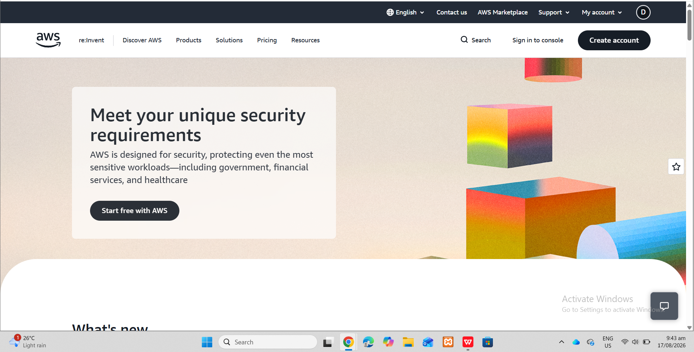

# AWS Research

## 1. Brief Overview

Amazon Web Services (AWS) is a cloud computing platform that provides a wide range of on-demand computing, storage, database, networking, security, and other technology services. Organizations can use AWS to build, deploy, and manage applications without having to maintain all of the underlying physical infrastructure themselves.

## 2. Global Infrastructure

AWS operates a global cloud infrastructure made up of geographic Regions and Availability Zones. AWS Regions are separate geographic areas, while Availability Zones are isolated locations within a Region that are designed to help applications achieve higher availability and resilience.

## 3. Cloud Management Console

The AWS Management Console is a web-based interface that allows users to access and manage AWS services. Users can create resources, configure services, monitor resources, and manage their cloud environment through the console.

## 4. Four Core Services

### Amazon EC2
Amazon Elastic Compute Cloud (EC2) provides virtual servers that can be used to run applications and workloads in the cloud.

### Amazon S3
Amazon Simple Storage Service (S3) provides scalable object storage for files, data, backups, and other objects.

### Amazon RDS
Amazon Relational Database Service (RDS) is a managed relational database service that simplifies the setup, operation, and scaling of relational databases.

### Amazon VPC
Amazon Virtual Private Cloud (VPC) allows users to create an isolated virtual network where AWS resources can be deployed and managed.

## 5. Three Advantages

### 1. Wide Range of Services
AWS provides a broad selection of cloud services for computing, storage, databases, networking, security, analytics, artificial intelligence, and other workloads.

### 2. Scalability
AWS allows organizations to increase or decrease resources according to their workload requirements.

### 3. Global Infrastructure
AWS provides a large global infrastructure that allows organizations to deploy applications closer to their users and design highly available systems.

## 6. Typical Enterprise Use Cases

AWS can be used by enterprises for web and mobile application hosting, data storage and backup, database workloads, disaster recovery, analytics, artificial intelligence, and scalable business applications.

## 7. Screenshot Evidence

The following screenshot shows the official AWS website used during my research.

