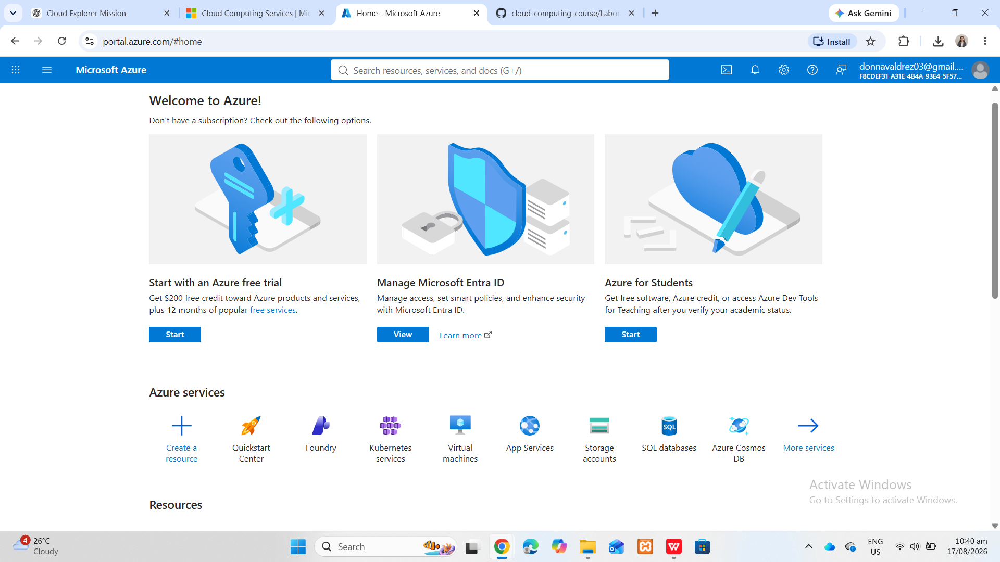

# Microsoft Azure Research

## 1. Brief Overview

Microsoft Azure is a cloud computing platform developed by Microsoft. It provides cloud services that organizations can use to develop, deploy, manage, and scale applications and infrastructure.

Azure offers services for computing, storage, networking, databases, security, artificial intelligence, analytics, and application development.

## 2. Global Infrastructure

Azure provides a global cloud infrastructure consisting of regions and datacenter infrastructure around the world. Organizations can select locations based on requirements such as performance, availability, compliance, and business needs.

Azure's global infrastructure helps organizations deploy applications closer to their users and support reliable cloud workloads.

## 3. Cloud Management Console

The Azure Portal is a web-based management interface used to manage Azure resources. Users can create and manage virtual machines, storage accounts, networks, applications, databases, and other cloud resources through a centralized portal.

The Azure Portal provides a unified interface for managing Azure cloud resources.

## 4. Four Core Services

### Azure Virtual Machines

Azure Virtual Machines provide scalable virtual computing resources for running Windows and Linux workloads in the cloud.

### Azure Blob Storage

Azure Blob Storage provides object storage for large amounts of unstructured data such as documents, images, videos, backups, and application data.

### Azure Virtual Network

Azure Virtual Network allows organizations to create private networks for Azure resources and connect cloud environments with on-premises infrastructure.

### Microsoft Entra ID

Microsoft Entra ID provides identity and access management capabilities that help organizations manage users, authentication, and access to resources.

## 5. Three Advantages

1. Azure provides strong integration with Microsoft technologies and enterprise environments.
2. Azure supports hybrid cloud scenarios and connections between on-premises infrastructure and cloud resources.
3. Azure provides a broad range of services for computing, storage, networking, databases, artificial intelligence, and enterprise applications.

## 6. Typical Enterprise Use Cases

Azure can be used for enterprise application hosting, Windows Server workloads, Microsoft-based environments, hybrid cloud infrastructure, database systems, analytics, artificial intelligence, disaster recovery, and application development.

## 7. Screenshot Evidence

The following screenshot shows the official Microsoft Azure website used during my research.

